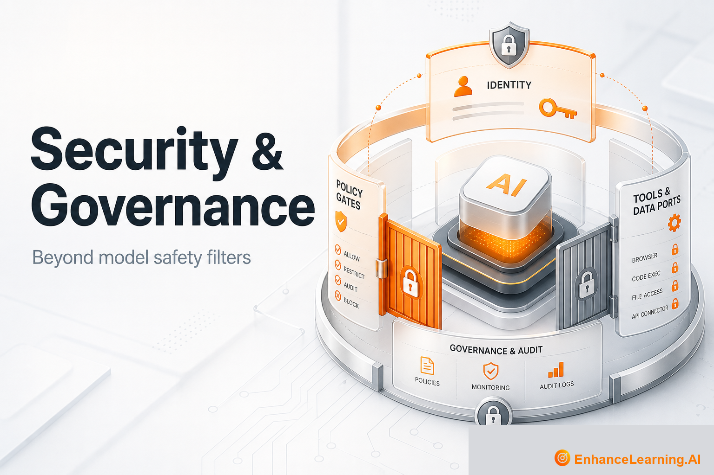

  

# Security & Governance: Protecting AI Systems Beyond Model Safety Filters

> Maintained reading path from [EnhanceLearning.AI](https://enhancelearning.ai) — practitioner-grade articles for engineers, architects, and technology leaders building production AI-native systems.

**Topic on the site:** [Security & Governance](https://enhancelearning.ai/articles?category=Security+%26+Governance) · **Full library:** [enhancelearning.ai/articles](https://enhancelearning.ai/articles)

## What this repo is

A curated reading path for **Security & Governance**. It is not a code SDK — it points to the foundation deep-dives on [EnhanceLearning.AI](https://enhancelearning.ai) so you can align on concepts, critique designs, and ship production systems that hold up.

These articles map AI security vs traditional AppSec, model-level vs system-level controls, prompt-injection basics, and the identity-policy-enforcement stack for AI-native products.

## Who it's for

Security architects, platform leads, and product owners shipping tool-using AI.

## Foundation articles

- [What AI Security Actually Covers Beyond Model Safety](https://enhancelearning.ai/articles/what-ai-security-actually-covers-beyond-model-safety) — AI security spans identity, permissions, data flows, and runtime policy — not just model alignment and output filters. A scope map for architects.
- [The Difference Between AI Security and Traditional Application Security](https://enhancelearning.ai/articles/difference-between-ai-security-and-traditional-application-security) — What carries over from AppSec into AI systems — and what breaks when LLMs and agents join the request path. Avoid blind playbook reuse.
- [The Difference Between Model-Level Safety and System-Level Security](https://enhancelearning.ai/articles/difference-between-model-level-safety-and-system-level-security) — Model safety filters harmful outputs; system security controls what your architecture can do. Why provider alignment is not your production posture.
- [The AI-Native Security Stack: Identity, Policy, and Enforcement Layers](https://enhancelearning.ai/articles/the-ai-native-security-stack-identity-policy-and-enforcement-layers) — A three-layer security stack for AI systems: agent identity, policy definition, and runtime enforcement. A shared model for engineering and governance.
- [Prompt Injection, Tool Abuse, and AI Security Basics](https://enhancelearning.ai/articles/prompt-injection-tool-abuse-ai-security-basics) — How prompt injection and tool abuse show up in production AI systems, and the controls that belong in code: isolation, allowlists, human gates, and monitoring.

## More from EnhanceLearning.AI

- Homepage: [https://enhancelearning.ai](https://enhancelearning.ai)
- All articles: [https://enhancelearning.ai/articles](https://enhancelearning.ai/articles)
- This topic filter: [Security & Governance](https://enhancelearning.ai/articles?category=Security+%26+Governance)
